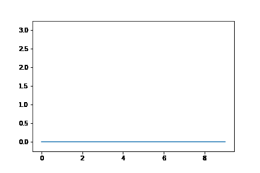

## mplcamera

---

#### This package is adapted from https://github.com/jwkvam/celluloid.  

---

Instead of capturing a figures artists like celluloid does, mplcamera takes an image snapshot of the whole figure.
This has the advantage that
- all plot contents should be captured
- we have the opportunity to use savefig keyword arguments like facecolor and bbox_inches.


Further, using imageio to save a gif provides the opportunity for using mimsave_kwargs:
- to define a duration between frames in seconds, either as int, or as a list individually for each frame.
- we can set the loop to 1 (gif animation stops after 1 loop) or any other amount of loops.

Disadvantages:
- Saving the images takes a little more time than with mplcamera.
- It might be memory intensive to store a lot of images in memory.

---

The goal of this package is to provide a simple way to create gifs that can be used for example
- to show the creation process of a plot
- to aid visual storytelling by being able to focus longer on individual frames, which allows to show annotations only for that time (simply remove them after you snap the frame.)


## Installation

```
pip install mplcamera
```


## Usage

The usage remains the same as with celluloid:

1) instantiate a Camera from a figure

```
import matplotlib.pyplot as plt
from mplcamera import Camera
fig = plt.figure()
cam = Camera(fig)
```

2) After each step of plotting take snapshots of the figure
```
cam.snap()
```

3) save the snapshots to a gif
```
cam.save('animation.gif')
```


## Example:
```

    import matplotlib.pyplot as plt
    from mplcamera import Camera

    fig, ax = plt.subplots()
    ax.set_ylim(-0.25, 3.25)

    cam = Camera(fig)
    for i in range(4):
        plt.plot([i] * 10)
        cam.snap()

    # use a different duration for frame 3. use loop=1 to not loop the gif
    mimsave_kwargs = {'duration': [0.25, 0.25, 1, 0.25], 'loop': 0}

    cam.save('mpl_camera_animation.gif', **mimsave_kwargs)

```

